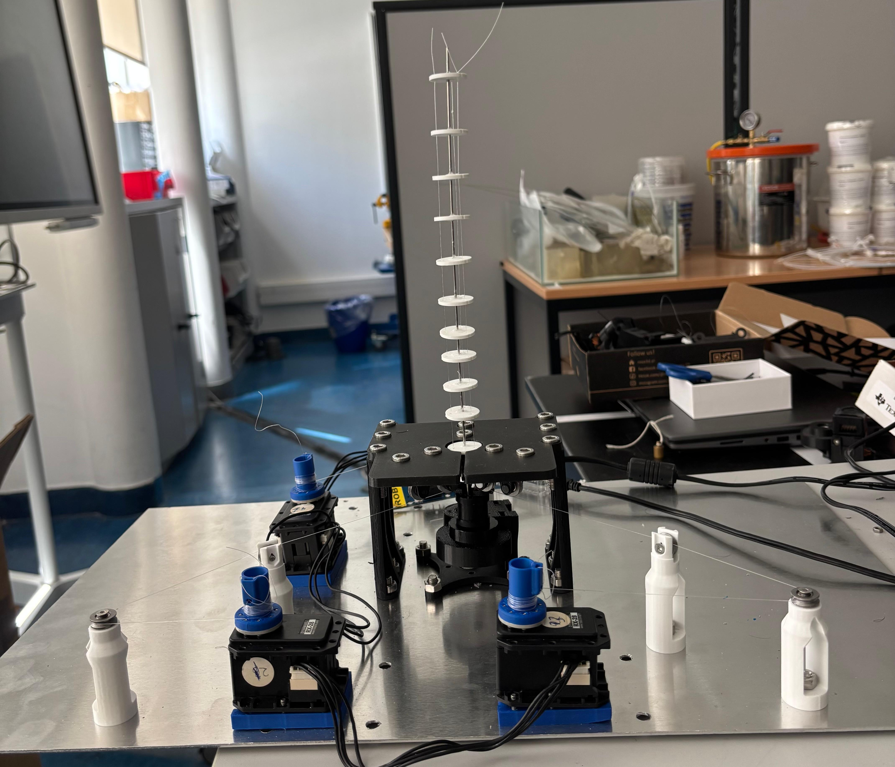

https://github.com/user-attachments/assets/0de2c3f7-74e6-4774-bb18-00cf13e078aa


# Tendon-Driven Continuum Robot Platform

A single-segment tendon-driven continuum robot developed during my
master's thesis internship at ISIR, Sorbonne Université, as part of the
Master's Degree in Mechatronic Engineering at Politecnico di Torino.

This project integrates static and dynamic Cosserat-rod modeling,
mechanical design, DYNAMIXEL tendon actuation, electronics, and
preliminary experimental evaluation of a physical TDCR prototype.



## Robot Demonstration

Physical prototype during tendon actuation.


https://github.com/user-attachments/assets/3df236bc-30ad-41d0-9584-1410d35f72d1


## Prototype

The developed robot consists of:

- A 250 mm hollow Nitinol backbone
- Eleven spacer disks
- Three nylon tendons arranged approximately 120° apart
- Three DYNAMIXEL RX-28 actuators
- Motor-driven tendon spools with a nominal effective radius of 2.5 mm
- A MATLAB R2025a actuation interface using the DYNAMIXEL SDK

The mathematical models use a nominal symmetric tendon-routing radius
of 6 mm. The supplied manufactured disk STL differs from this nominal
model geometry; the measured mesh geometry and related reproducibility
notes are documented in
[`mechanical/README.md`](mechanical/README.md).

## Modeling Approach

### Static Cosserat-Rod Models

Two static Cosserat-rod formulations are included.

**Newtonian formulation**

The Newtonian model is based on distributed force and moment equilibrium.
The spatial equations are integrated numerically using `ode45`, while a
shooting method and `fsolve` are used to satisfy the boundary conditions.

**Lagrangian formulation**

The Lagrangian model represents the rod strains through a finite
strain-basis approximation and determines the equilibrium configuration
using an energy-based formulation and Newton-Raphson iteration.

For the loading cases examined in the thesis, the two formulations
produced practically identical predicted tip positions.

The corresponding implementations are available in
[`modeling/`](modeling/).

### Displacement-to-Tension Iteration

The static Cosserat formulations use tendon tension as a model input,
while the physical actuation system is commanded using nominal tendon
pull.

An outer PD-based numerical iteration was therefore implemented to
adjust tendon tension until the Newtonian model reproduces a prescribed
tendon shortening.

This procedure is an offline numerical algorithm and is separate from
the physical DYNAMIXEL motor controller.

### Dynamic Model

The dynamic Cosserat-rod implementation investigates the transient
backbone response under time-dependent tendon tensions.

The formulation includes backbone inertia, internal damping, gravity,
drag, and time-dependent tendon loading. Temporal integration is based
on an implicit BDF-alpha formulation combined with spatial integration
of the rod equations.

The dynamic results contained in this repository are numerical
predictions and were not experimentally validated during the project.

## Actuation and Electronics

Three ROBOTIS DYNAMIXEL RX-28 actuators are used, with one actuator
assigned to each tendon.

The implemented communication architecture is:

```text
Computer / MATLAB R2025a
        |
       USB
        |
   ROBOTIS U2D2
        |
      RS-485
        |
   U2D2 Power Hub
        |
   RS-485 + Power
        |
      RX-28 ID 1
        |
    Daisy chain
        |
      RX-28 ID 2
        |
    Daisy chain
        |
      RX-28 ID 3
```

The MATLAB actuation interface converts prescribed nominal tendon pulls
into DYNAMIXEL Goal Position commands.

The motor shaft positions are internally regulated by the RX-28
controllers. However, actual tendon displacement, tendon tension,
backbone shape, and robot tip position are not directly measured.

The implementation is available in
[`actuation/`](actuation/), while the hardware architecture is
documented in [`electronics/`](electronics/).

## Preliminary Experimental Evaluation

The physical robot was compared with the Newtonian static model using
one unloaded condition and six single-active-tendon tests.

The nominal tendon-pull commands were 5 mm and 10 mm.

| Metric | Value |
|---|---:|
| Mean absolute vertical-position error | 11.54 mm |
| Root-mean-square vertical-position error | 14.01 mm |
| Maximum absolute vertical-position error | 21.08 mm |
| Mean relative error | Approximately 6.51% |

The model reproduced the principal relationship between increasing
nominal tendon pull and increasing backbone deformation.

However, the physical robot bent less than predicted by the static model,
particularly for the 10 mm commands.

Possible sources of discrepancy include tendon friction, slack,
elongation or permanent deformation, spool-winding effects,
manufacturing asymmetries, mechanical tolerances, and uncertainty
between commanded and actual tendon displacement.

The complete experimental comparison is documented in
[`experiments/`](experiments/).

## Repository Structure

| Location | Contents |
|---|---|
| [`modeling/`](modeling/) | Newtonian and Lagrangian static models, dynamic model, displacement-to-tension iteration, comparison scripts, and supporting MATLAB functions |
| [`actuation/`](actuation/) | MATLAB interface for commanding the DYNAMIXEL RX-28 actuators |
| [`mechanical/`](mechanical/) | Mechanical STL files and geometry/reproducibility documentation |
| [`electronics/`](electronics/) | Communication, power, U2D2, Power Hub, and actuator documentation |
| [`experiments/`](experiments/) | Experimental comparison figures, results, metrics, and discussion |
| [`docs/`](docs/) | Master's thesis and thesis documentation |
| [`media/`](media/) | Prototype photographs and robot demonstration video |
| [`CITATION.cff`](CITATION.cff) | Citation metadata for this repository |
| [`THIRD_PARTY_NOTICES.md`](THIRD_PARTY_NOTICES.md) | Attribution and third-party software information |
| [`LICENSE`](LICENSE) | GNU General Public License v3.0 |

## Master's Thesis

The complete thesis associated with this repository is:

**Static and Dynamic Cosserat-Rod Modeling of a Single-Segment
Tendon-Driven Continuum Robot**

**Author:** Mohamad Nour Edeen  
**Master's Degree:** Mechatronic Engineering  
**University:** Politecnico di Torino  
**Research host:** ISIR, Sorbonne Université

[Read the thesis PDF](docs/Master_Thesis_Mohamad_Nouredeen.pdf)

Additional thesis information is available in
[`docs/README.md`](docs/README.md).

## Software Requirements

The thesis implementations were developed using **MATLAB R2025a**.

The static Newtonian and dynamic implementations use `fsolve` from the
MATLAB Optimization Toolbox.

The physical actuation interface additionally requires the
ROBOTIS DYNAMIXEL SDK and compatible DYNAMIXEL hardware.

The repository version has not yet been independently reproduced on a
separate computer. Users should therefore verify dependencies,
environment configuration, and hardware settings before execution.

## Attribution

Parts of the static Newtonian and Lagrangian Cosserat-rod
implementations are adapted from the open-source TIMClab-CAMI project
associated with:

Matthias Tummers et al. (2023),  
**"Cosserat Rod Modeling of Continuum Robots from Newtonian and
Lagrangian Perspectives,"**  
*IEEE Transactions on Robotics*.

DOI:  
https://doi.org/10.1109/TRO.2023.3238171

Original implementation:  
https://github.com/TIMClab-CAMI/Cosserat-Rod-Modeling-of-Tendon-Actuated-Continuum-Robots

The project-specific adaptations include robot geometry and material
parameters, tendon-routing configuration, additional numerical outputs,
comparison procedures, and the displacement-to-tension iteration.

Detailed attribution information is provided in
[`THIRD_PARTY_NOTICES.md`](THIRD_PARTY_NOTICES.md).

The repository includes the applicable GPL-3.0 license text in
[`LICENSE`](LICENSE).

## Citation

If you use material from this repository, please cite the repository
using the metadata provided in:

[`CITATION.cff`](CITATION.cff)

Users of the adapted static Cosserat-rod implementation should also cite
the original Tummers et al. publication listed above.

## Author

**Mohamad Nour Edeen**
