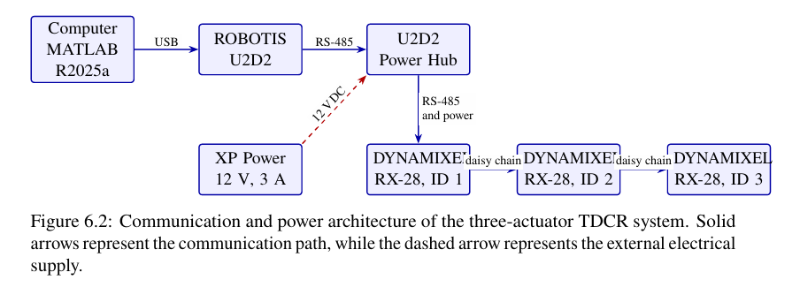
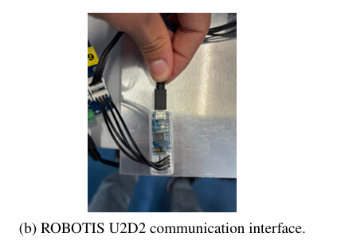
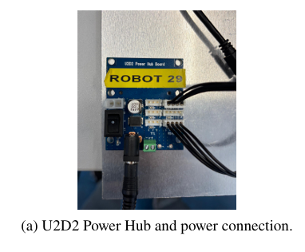
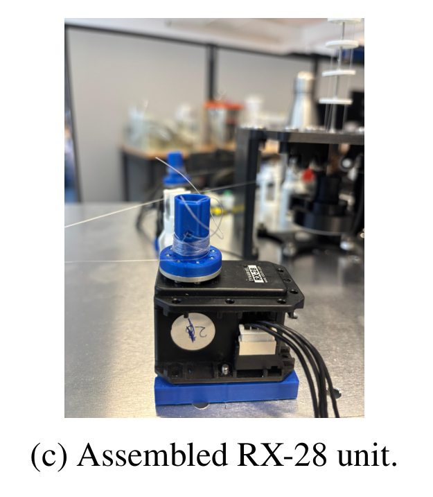
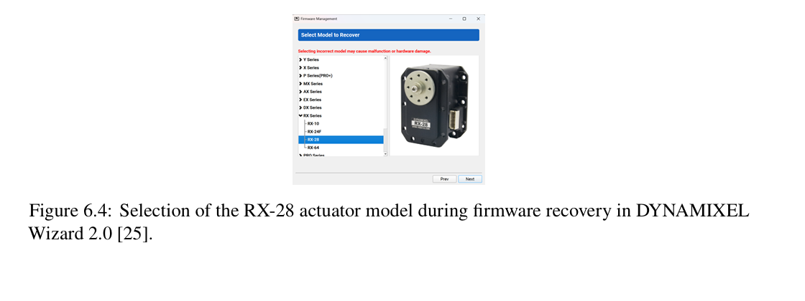

# Electronics and Actuation Hardware

This folder documents the electronic, communication, and actuator architecture implemented for the tendon-driven continuum robot platform.

The system uses three ROBOTIS DYNAMIXEL RX-28 actuators, one for each tendon. MATLAB R2025a communicates with the actuators through a ROBOTIS U2D2 interface and a U2D2 Power Hub.

## System Architecture



The implemented communication and power chain is:

```text
Computer / MATLAB R2025a
        |
       USB
        |
   ROBOTIS U2D2
        |
      RS-485
        |
   U2D2 Power Hub
        |
   RS-485 + Power
        |
 DYNAMIXEL RX-28, ID 1
        |
    Daisy chain
        |
 DYNAMIXEL RX-28, ID 2
        |
    Daisy chain
        |
 DYNAMIXEL RX-28, ID 3
 
 An external 12 V, 3 A power supply is connected to the U2D2 Power Hub, which distributes power and communication to the three actuators.

The motor assignments are:

| Motor ID | Function |
|---|---|
| ID 1 | Tendon 1 |
| ID 2 | Tendon 2 |
| ID 3 | Tendon 3 |

## ROBOTIS U2D2 Interface



The U2D2 provides the communication interface between the computer and the DYNAMIXEL actuator network.

## U2D2 Power Hub



The U2D2 Power Hub connects the communication interface, external power supply, and actuator network.

## DYNAMIXEL RX-28 Actuation Unit



Three DYNAMIXEL RX-28 actuators are mounted on the mechanical base. Each actuator controls one tendon through the corresponding spool and transmission mechanism.

The actuators regulate their shaft position internally. However, the robot does not directly measure tendon tension, actual tendon displacement, backbone shape, or tip position.

## Motor Configuration



The actuators were configured and identified using ROBOTIS DYNAMIXEL Wizard 2.0. Unique motor IDs allow all three actuators to share the same communication bus while remaining independently addressable.

## MATLAB Actuation Interface

The corresponding MATLAB implementation is located in:

[`../actuation/TDCR_MotorPullCommand.m`](../actuation/TDCR_MotorPullCommand.m)

The script converts prescribed nominal tendon pulls into DYNAMIXEL Goal Position commands.

The nominal spool radius used in the implementation is 2.5 mm.

## System Limitations

The current platform does not directly measure:

- Actual tendon displacement
- Tendon tension
- Tendon elongation
- Backbone configuration
- Tip position

Therefore, friction, tendon slack, elongation, spool winding, and mechanical tolerances can cause differences between the nominal command and the actual robot motion.

## Related Documentation

See the [main project README](../README.md) for the complete project overview.

Mechanical components and STL files are documented in [`../mechanical/`](../mechanical/).