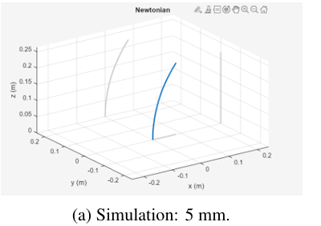
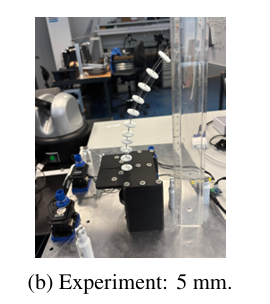
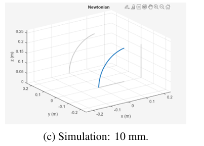
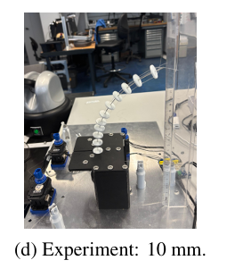
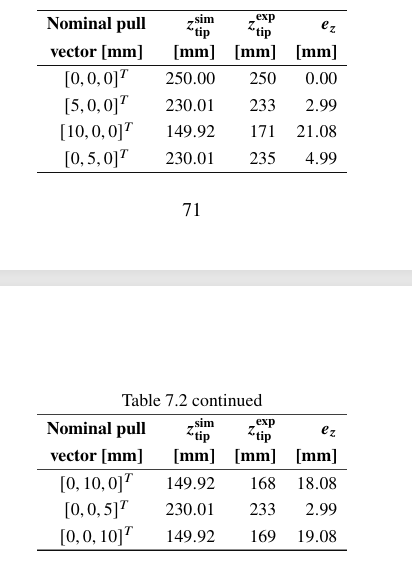

# Experimental Validation

This folder documents the preliminary experimental validation of the
single-segment tendon-driven continuum robot (TDCR).

The experimental tests compare the physical prototype with predictions
obtained from the Newtonian static Cosserat-rod model under equivalent
nominal tendon-pull commands.

## Validation Objective

The objective of the experiments was to evaluate whether the static
Cosserat-rod model reproduces the principal bending behavior of the
physical TDCR.

The comparison focused on the vertical coordinate of the robot tip,
\(z_{\mathrm{tip}}\), under single-active-tendon commands.

The validation should be considered preliminary because the experimental
setup did not directly measure tendon displacement, tendon tension, or the
complete three-dimensional backbone configuration.

## Test Cases

Seven operating conditions were evaluated:

| Test | Nominal tendon pull [mm] |
|---|---|
| Unloaded | [0, 0, 0] |
| Tendon 1 | [5, 0, 0] |
| Tendon 1 | [10, 0, 0] |
| Tendon 2 | [0, 5, 0] |
| Tendon 2 | [0, 10, 0] |
| Tendon 3 | [0, 0, 5] |
| Tendon 3 | [0, 0, 10] |

Only one tendon was actively commanded during each loaded test.

## Simulation and Experimental Results

The measured vertical tip coordinates were compared with the values
predicted by the Newtonian static model.

| Nominal tendon pull [mm] | Simulation z-tip [mm] | Experiment z-tip [mm] | Absolute error [mm] |
|---|---:|---:|---:|
| [0, 0, 0] | 250.00 | 250 | 0.00 |
| [5, 0, 0] | 230.01 | 233 | 2.99 |
| [10, 0, 0] | 149.92 | 171 | 21.08 |
| [0, 5, 0] | 230.01 | 235 | 4.99 |
| [0, 10, 0] | 149.92 | 168 | 18.08 |
| [0, 0, 5] | 230.01 | 233 | 2.99 |
| [0, 0, 10] | 149.92 | 169 | 19.08 |

Across the six loaded cases:

| Metric | Value |
|---|---:|
| Mean absolute error | 11.54 mm |
| Root-mean-square error | 14.01 mm |
| Maximum absolute error | 21.08 mm |
| Mean relative error | Approximately 6.51% |

The largest absolute error occurred for the `[10, 0, 0]` mm command.

## 5 mm Tendon-Pull Comparison

### Simulation

### Experiment

For the 5 mm single-tendon commands, the experimental vertical tip
coordinates remained relatively close to the model predictions.

The measured values were 233 mm, 235 mm, and 233 mm for Tendons 1, 2,
and 3, respectively, compared with a predicted value of approximately
230.01 mm.

## 10 mm Tendon-Pull Comparison

### Simulation

### Experiment

The discrepancy increased for the 10 mm commands.

The static model predicted a vertical tip coordinate of approximately
149.92 mm, while the experimental measurements were 171 mm, 168 mm,
and 169 mm for Tendons 1, 2, and 3, respectively.

The physical robot therefore bent less than predicted by the static
model at the larger nominal tendon pulls.

## Original Thesis Results Table

The figure above reproduces the validation table reported in the thesis.
The numerical values are also provided directly in this README for
clarity and accessibility.

## Discussion

The experimental results reproduce the main qualitative trend predicted
by the model: increasing the nominal tendon pull produces greater
backbone deformation.

The results also show reasonable symmetry between the three tendon
directions. For the 5 mm commands, the measured vertical coordinates
were 233 mm, 235 mm, and 233 mm. For the 10 mm commands, they were
171 mm, 168 mm, and 169 mm.

However, the physical prototype consistently bent less than predicted
by the static model in the loaded cases, with the discrepancy becoming
more significant at the 10 mm commands.

Several effects can contribute to this difference:

- Tendon friction
- Tendon slack
- Tendon elongation and possible permanent deformation
- Spool-winding effects
- Mechanical tolerances
- Manufacturing asymmetries
- Uncertainty between commanded and actual tendon displacement
- Unmodeled transmission effects

Some of these effects are not represented in the static model.

## Experimental Limitations

The validation has several important limitations:

- Tendon tension was not directly measured.
- Actual tendon displacement was not directly measured.
- The complete backbone shape was not measured quantitatively.
- Only the vertical tip coordinate was used for the numerical comparison.
- Measurements were obtained manually.
- One measurement was available for each operating point.
- No statistical repeatability analysis was performed.

The reported results should therefore be interpreted as preliminary
experimental validation rather than a complete quantitative
identification of the robot model.

## Related Files

The static and dynamic Cosserat-rod implementations are available in:

[`../modeling/`](../modeling/)

The DYNAMIXEL motor command implementation is available in:

[`../actuation/`](../actuation/)

The electronic and actuator architecture is documented in:

[`../electronics/`](../electronics/)

The mechanical components and STL files are documented in:

[`../mechanical/`](../mechanical/)

For the complete project overview, see the
[main project README](../README.md).